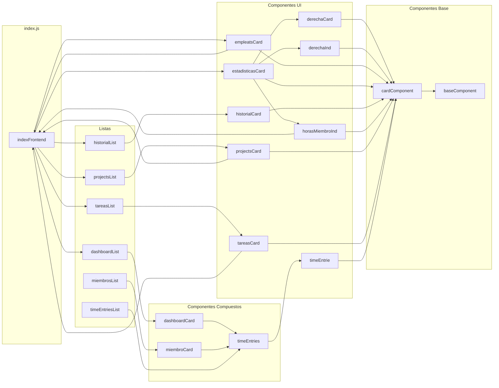
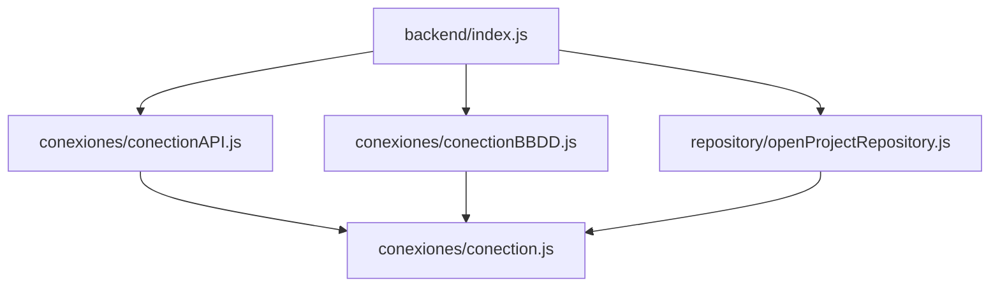

# WebComponent

## Estructura

```bash
proyecto/frontend/js/
├── components
│   ├── CardComponent.js
│   ├── dashboardCard.js
│   ├── derechaCardindividual.js
│   ├── derechaCard.js
│   ├── empleatsCard.js
│   ├── estadisticasCard.js
│   ├── historialCard.js
│   ├── horasProjectosMiembroCardindividual.js
│   ├── horasProjectosMiembroCard.js
│   ├── miembroCard.js
│   ├── projectsCard.js
│   ├── tareasCard.js
│   ├── TimeEntrie.js
│   └── TimeEntries.js
├── libcomponents
│   └── base_component.js
└── listas
    ├── DashboardList.js
    ├── historialList.js
    ├── miembrosList.js
    ├── projectsList.js
    ├── tareasList.js
    └── TimeEntriesList.js
```




