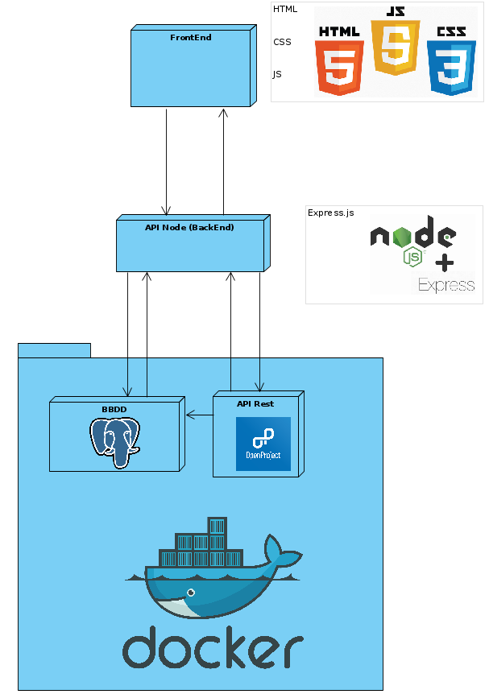

# autis

## Uso

Software para la gestión de proyectos para la empresa Autis, usando de base OpenProject.

## Solución aportada

Gestión administrativa de usuarios, proyectos y tareas; así como la visualización de los datos de estos y de los trabajos realizados.

## Equipo de desarrollo

- Jonathan David Signes Falcó: [Full-Stack, Jefe del Backend, ayudante de FrontEnd]
- Lucas Barabaschi Hryniuk: (Pinta botones) [FrontEnd, Jefe del Frontend, Scrum Master]
- Roly Alcoser Rocha: [Full-Stack, ayudante en ambos aspectos, Controlador del GitHub]

## Lenguaje utilizado

- HTML
- CSS
- JavaScript

## Base de datos utilizado

- PostgreSQL

## Tecnologías utilizadas

- Node.js
- Express.js
- Web Component
- Char.js

## Requisitos

- node.js: igual o superior a v.18.0.0
- express.js: igual o superior a v.5.1.0

## Primeros pasos

1. Git instalado
2. Disponer del contenedor OpenProject en docker
   1. Puerto 8080 para la web propia del openProject y la conexión con su API.
   2. Puerto 5555 para la conexión con la base de datos.
3. Disponer de una ApiKey
4. Habilitar CORS
5. Habilitar "Eliminar" del usuario
6. Clonar repositorio
7. Inicializar el contenedor Docker
8. Inicializar Node.js en la carpeta del autis/proyecto/backend
9. Abrir en un navegador localhost/3000

## Estructura del proyecto

```bash
proyecto
├── backend
│   ├── conexiones
│   ├── index.js
│   ├── package.json
│   ├── package-lock.json
│   └── repository
└── frontend
    ├── assets
    ├── css
    ├── html
    ├── img
    └── js
        ├── components
        ├── index.js
        ├── libcomponents
        ├── listas
        └── tocken.js

```

## Diagrama de componentes



## EndPoint

| Num | Endpoint                   | Conexión      | Descripción                                                                           |
|-----|----------------------------|---------------|---------------------------------------------------------------------------------------|
| 1   | /dashboard                 | ConexiónBBDD  | Devuelve datos de usuarios para el dashboard                                         |
| 2   | /timeEntries/dia           | ConexiónBBDD  | Devuelve el timeEntry de un usuario en un día concreto para el dashboard             |
| 3   | /usuarios                  | ConexiónBBDD  | Devuelve una lista de nombres e IDs de usuarios                                      |
| 4   | /proyectos                 | ConexiónBBDD  | Devuelve una lista de nombres e IDs de proyectos                                     |
| 5   | /tareas                    | ConexiónBBDD  | Devuelve una lista de nombres e IDs de tareas                                        |
| 6   | /tipoTareas                | ConexiónBBDD  | Devuelve una lista de tipos de tareas                                                |
| 7   | /usuarios/filtrar/proyecto | ConexiónBBDD  | Devuelve usuarios basados en el nombre del proyecto 'x'                              |
| 8   | /usuarios/filtrar/id       | ConexiónBBDD  | Devuelve un usuario por ID                                                           |
| 9   | /usuarios/filtrar/nombre   | ConexiónBBDD  | Devuelve un usuario por nombre                                                       |
| 10  | /proyectos/filtrar/id      | ConexiónBBDD  | Devuelve un proyecto por ID                                                          |
| 11  | /proyectos/filtrar/nombre  | ConexiónBBDD  | Devuelve un proyecto por nombre                                                      |
| 12  | /tareas/filtrar/id         | ConexiónBBDD  | Devuelve una tarea por ID                                                            |
| 13  | /tareas/filtrar/nombre     | ConexiónBBDD  | Devuelve una tarea por nombre                                                        |
| 14  | /usuario/mod               | ConexiónAPI   | Modifica un usuario 'x'                                                              |
| 15  | /usuario/mod/datos         | ConexiónBBDD  | Recoge los datos del usuario que se quiere modificar                                 |
| 16  | /proyecto/mod              | ConexiónAPI   | Modifica un proyecto 'x'                                                             |
| 17  | /proyecto/mod/datos        | ConexiónBBDD  | Recoge los datos del proyecto que se quiere modificar                                |
| 18  | /tarea/mod                 | ConexiónAPI   | Modifica una tarea 'x'                                                               |
| 19  | /tarea/mod/datos           | ConexiónBBDD  | Recoge los datos de una tarea que se quiere modificar                                |
| 20  | /usuario/crear             | ConexiónAPI   | Crea un usuario                                                                      |
| 21  | /proyecto/crear            | ConexiónAPI   | Crea un proyecto                                                                     |
| 22  | /tarea/crear               | ConexiónAPI   | Crea una tarea                                                                       |
| 23  | /usuario/borrar            | ConexiónAPI   | Borra un usuario                                                                     |
| 24  | /proyecto/borrar           | ConexiónAPI   | Borra un proyecto                                                                    |
| 25  | /tarea/borrar              | ConexiónAPI   | Borra una tarea                                                                      |
| 26  | /historial                 | ConexiónBBDD  | Recoge todos los timeEntries de un usuario en un rango de fechas                    |
| 27  | /tocken                    | ConexiónAPI   | Recoge el token y comprueba que está correcto                                        |
| 28  | /groups                    | ConexiónBBDD  | Recoge los grupos                                                                    |
| 29  | /group/users               | ConexiónBBDD  | Recoge usuarios por grupo                                                            |
| 30  | /group/projects            | ConexiónBBDD  | Recoge proyectos por grupo                                                           |
| 31  | /horas/miembro             | ConexiónBBDD  | Recoge las horas trabajadas de un usuario de un grupo concreto entre dos fechas      |
| 32  | /horas/miembros            | ConexiónBBDD  | Recoge las horas trabajadas de todos los usuarios de un grupo en total               |
| 33  | /horas/miembros/proyecto   | ConexiónBBDD  | Recoge las horas trabajadas de un usuario de un grupo concreto en un proyecto        |
| 34  | /horas/usuario             | ConexiónBBDD  | Recoge las horas trabajadas de un usuario 'x' en un rango de fechas                  |
| 35  | /tareas/usuario            | ConexiónBBDD  | Recoge las tareas asignadas al usuario                                               |
| 36  | /horas/usuario/tarea       | ConexiónBBDD  | Recoge las horas trabajadas de un usuario 'x' en una tarea y un rango de fechas      |
| 37  | /horas/usuario/proyecto    | ConexiónBBDD  | Recoge las horas trabajadas de un usuario 'x' en un proyecto y un rango de fechas    |
| 38  | /proyecto/igual            | ConexiónBBDD  | Comprueba si ya hay un proyecto con un nombre en concreto                            |
